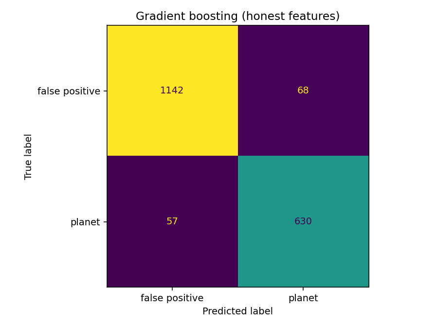
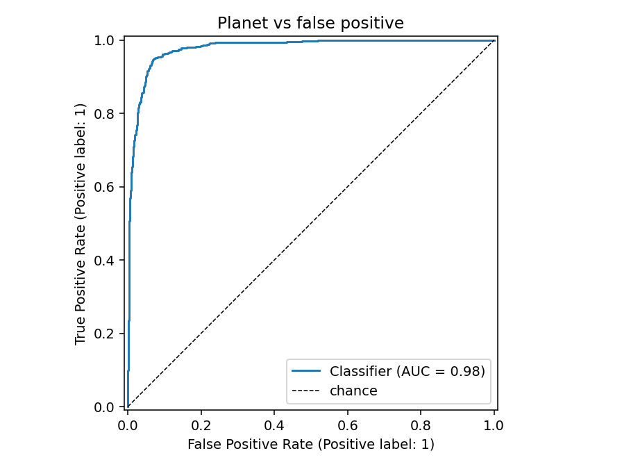
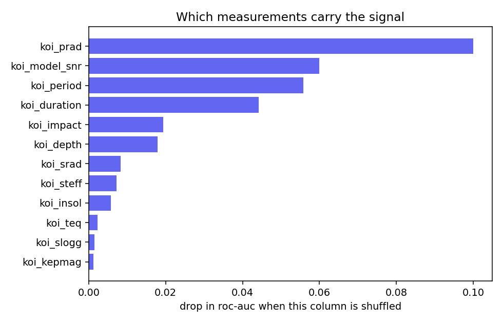

# Machine learning: telling real planets from false alarms

The Deep Field app teaches the *search* half of exoplanet hunting — Box Least
Squares, which folds a light curve at every candidate period and finds the
repeating dip. That algorithm is pure physics: you tell it what a transit looks
like, and it goes and finds the best match. Nothing is learned.

But finding a dip is the easy half. Most periodic dips in Kepler data are **not
planets**. They are eclipsing binary stars, light from a nearby star bleeding
into the aperture, or instrument artefacts. Sorting those out was done by human
vetters, one candidate at a time, for years.

That is the part worth learning from data, because "does this look like the
false positives humans rejected" is a pattern nobody can write down as an
equation. This directory trains a classifier to do it.

## Running it

```bash
pip install -r requirements.txt
python fetch_data.py    # downloads the labelled data (~900 KB)
python train.py         # trains, evaluates, writes plots to artifacts/
```

No API key needed. `fetch_data.py` pulls from the NASA Exoplanet Archive's
public TAP service.

## The data

The **Kepler Objects of Interest** catalogue: every periodic dip Kepler's
pipeline flagged, with the verdict humans eventually reached.

| Disposition | Count | |
|---|---|---|
| FALSE POSITIVE | 4,839 | 63.8% |
| CONFIRMED | 2,748 | 36.2% |
| *CANDIDATE* | *1,977* | *excluded — not yet adjudicated, so no label* |

7,587 labelled examples. The label is `koi_disposition`; the features are the
measurements — orbital period, transit depth and duration, inferred planet
radius, signal-to-noise, impact parameter, and properties of the host star.

## Results

Every number below comes from `train.py` on a held-out 25% test split
(1,897 systems the model never saw during training).

| Model | Accuracy | ROC-AUC |
|---|---|---|
| Always guess "false positive" | 0.638 | — |
| Logistic regression | 0.832 | 0.902 |
| **Gradient boosting** | **0.934** | **0.978** |

5-fold cross-validated ROC-AUC: **0.978 ± 0.002**. The tiny spread matters — it
says the result is a property of the data, not a lucky split.

The baseline row is there on purpose. A dataset that is 63.8% one class means a
model that learns nothing and always guesses the majority still scores 0.638.
Quoting "93% accurate" without that comparison hides how much was actually
learned: the real gain is 0.638 → 0.934.




## The lesson that matters most: label leakage

The KOI table contains four columns named `koi_fpflag_nt`, `koi_fpflag_ss`,
`koi_fpflag_co` and `koi_fpflag_ec`. They look like features. They are not —
they are the **vetting pipeline's conclusions**, the reasons a candidate was
rejected. They encode the answer.

Train the same model with them included:

| Features | Accuracy | ROC-AUC |
|---|---|---|
| Measurements only | 0.934 | 0.978 |
| Measurements **+ vetting flags** | 0.995 | 0.999 |

99.5% accuracy. It looks like a much better model. It is a worthless one: at
prediction time on a genuinely new candidate, those flags do not exist yet —
producing them *is* the job you were trying to automate.

This is the most common way a machine learning result turns out to be fiction,
and it rarely announces itself. It shows up as a suspiciously good score. The
defence is not a technique, it is a question asked of every column: *would I
actually have this value at the moment I need to make the prediction?*

`train.py` trains it both ways deliberately, so the gap is visible.

## What the model learned

Permutation importance — shuffle one column and measure how much ROC-AUC drops:



| Feature | Drop in ROC-AUC |
|---|---|
| `koi_prad` — planet radius | +0.100 |
| `koi_model_snr` — signal-to-noise | +0.060 |
| `koi_period` — orbital period | +0.056 |
| `koi_duration` — transit duration | +0.044 |
| `koi_impact` — impact parameter | +0.019 |
| `koi_depth` — transit depth | +0.018 |

These are physically sensible, which is the reassuring part — the model found
real astronomy rather than an artefact of how the table was assembled:

- **Planet radius dominates.** Radius is inferred from transit depth and the
  star's size. An object that comes out at two or three Jupiter radii is not a
  planet, because planets do not get much bigger than Jupiter — add mass and
  they compress. A "planet" that large is almost always a small star eclipsing
  a bigger one. The model rediscovered the single strongest giveaway that human
  vetters use.
- **Signal-to-noise matters** because weak signals are disproportionately
  instrumental noise rather than real astrophysics.
- **Stellar properties barely matter** (`koi_slogg`, `koi_kepmag` sit near
  zero). Whether something is a planet is a property of the signal, not of how
  bright the star happens to look from Earth.

## How this connects to the app

The two halves are complementary, and the split mirrors real practice:

| | In the app (TypeScript, in-browser) | Here (Python) |
|---|---|---|
| Job | Find periodic dips | Judge whether a dip is a planet |
| Method | Box Least Squares | Gradient-boosted trees |
| Learned from data? | No — physics model | Yes — from 7,587 human verdicts |
| Why | You know exactly what shape to look for | Nobody can write the rule down |

Hand-built model where the physics is understood, learned model where it is
not. That combination is how most real scientific ML works — and it is why the
app's search runs live in your browser while this trains offline.

## What this is not

A production vetting system. Real pipelines work from the pixels and the full
light curve, not a summary table — Google's AstroNet (Shallue & Vanderburg,
2018) fed folded light curves to a convolutional network and recovered two
genuine planets, Kepler-80 g and Kepler-90 i, that the existing pipeline had
discarded. This trains on twelve summary numbers per candidate. It is a model
you can read end to end in one sitting, which is the point.

The CANDIDATE rows are also excluded rather than predicted. Running the trained
model over them would be the obvious next experiment — though with no labels,
you could not score it.

## Sources

- [NASA Exoplanet Archive](https://exoplanetarchive.ipac.caltech.edu/) — KOI cumulative table
- [Column definitions](https://exoplanetarchive.ipac.caltech.edu/docs/API_kepcandidate_columns.html)
- Shallue & Vanderburg 2018, *Identifying Exoplanets with Deep Learning*, [AJ 155, 94](https://doi.org/10.3847/1538-3881/aa9e09)
